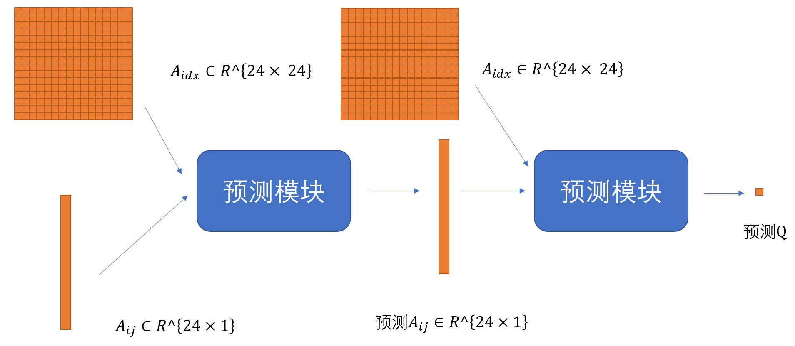

# bp训练网络

## 网络介绍

模型使用位置编码模型，设计了优化模块对随机的Aij输入预测出优化后的Aij， 同时设计了预测模块预测Q，采用端到端训练网络。

### 主要框架
- 串联形式
- 

### 优化模块
- 结构：
    - 4层多层感知器（MLP），初始配置层为为[25，16，14，8，4，1]， 其中25是输入层，为对每一个输入的Aij（1维）和对应的索引（24维）结合的特征；[16,14,8,4]是四层隐藏层，最终输出优化的1维Aij。
- 输入：
    - 24 * 1 尺寸大小的的Aij数组
    - 24 * 24 尺寸大小的每个Aij对应的索引

- 输出：
    - 24 * 1的Aij预测结果

### 预测模块
- 结构：
    - 4层多层感知器（MLP），初始配置层为为[25，16，14，8，4，1]， 其中2是输入层，为对每一个输入的Aij（1维）和对应的索引（24维）结合的特征；[16,14,8,4]是四层隐藏层，最终输出优化的标量Q的预测值。
- 输入：
    - 24 * 1 尺寸大小的Aij预测数组
    - 24 * 24 尺寸大小的每个Aij对应的索引

- 输出：
    - 1 * 1 尺寸大小的的Q预测结果

### 损失函数Loss
- $Loss = \sum (A_{ij} - A_{pred_{ij}}) ^ 2 + (Q - Q_{pred}) ^ 2$
- 第一项为预测优化后Aij的误差值，第二项为预测Q的误差值

## 操作说明

### 安装环境
- 安装anaconda
    - 输入`cmd`打开命令行，输入`conda info -e`有输出则为安装成功
- 配置环境
    - 命令行操作进入当前目录 `cd 你的目录`
    - 在命令行中输入`conda env create -f pytorch18.yaml `安装环境

### 运行网络
- 命令行输入`python train.py --cfg 你的配置.yaml`训练网络
- 示例：命令行输入`python train.py --cfg python train.py --cfg experiments/net1.yaml`训练预设配置的网络

### 修改参数
- 在experimets中创建yaml，修改相应的参数，具体参数在net1.yaml中有注释
- 运行网络
- 网络参数保存位置： params文件夹
- 网络训练效果可视化： train.png文件
- debug： 在train.py文件开始debug

## 文件功能详细介绍
- BPNN
	- model.py 模型框架，包含了模型的类文件和自定义的激活函数
- data
	- data.py 构建数据集文件， 包括数据集的类， 创建仿真数据和导入xlsx数据的函数
	- data.xlsx 数据文件
- experiments
    - *.yaml 自定义的配置文件，主要在里面修改网络相关参数，训练参数,
        ** 每次修改参数建议重新创建一个yaml文件**
- params
	- *.pt 网络参数保存的位置
- utils
    - config.py 初始化设置文件，建议不要改动
    - model_sl.py 用于网络参数保存的函数
    - parse_args.py 用于交互输入的函数

- pytroch18.yaml 创建conda环境配置文件
- train.py 训练模型程序， debug主要文件
- train.png 可视化训练效果，左图为验证集精度，右图为loss下降

